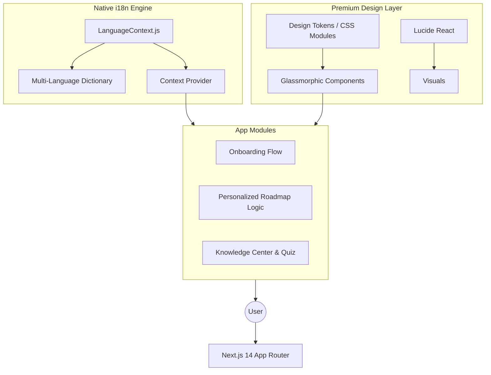

# 🗳️ VoteBuddy: A Localized, AI-Driven Voting Assistant

**VoteBuddy** is an advanced web platform engineered to bridge the gap between complex election procedures and the multi-linguistic fabric of India. It leverages modern web technologies to provide a high-fidelity, inclusive, and personalized onboarding experience for first-time and veteran voters.

---

## 🌍 Why This Matters (The Vision)

India is a land of diverse languages and complex bureaucracy. Voter turnout among youth often suffers due to:
1.  **Language Barriers**: Official portals are often limited in regional dialect support.
*   **Information Overload**: Finding the specific "next step" in a sea of forms is daunting.
*   **Access Inequality**: Not everyone has a mentor to guide them through their first election.

**VoteBuddy** solves this by providing a **mentorship-in-an-app** experience, translating complex laws into simple, actionable roadmaps in the user's native tongue.

---

## 🏗️ Technical Architecture

VoteBuddy follows a **Decoupled Client-Side Architecture** designed for high performance and zero-latency localized rendering.



### 🧠 Core Architectural Principles:
-   **Zero-Dependency i18n**: Unlike heavy libraries like `react-i18next`, VoteBuddy uses a custom-built, lightweight Context API engine for instant language switching without page reloads or bundle bloat.
-   **Responsive Design Tokens**: The app uses a strict design token system for spacing and colors to ensure consistent glassmorphism across all viewports.
-   **Serverless Ready**: Optimized for edge deployment (Vercel) to ensure high availability during peak election cycles.

---

## 🔥 Standout Feature: The Native Localized Experience

The crown jewel of VoteBuddy is its **Localized State Management**. We don't just translate strings; we manage the user's journey in their preferred context.

### Technical Implementation:
The `LanguageContext` acts as a high-order state manager that intercepts all text rendering. By utilizing a nested dictionary mapping (`translations[lang][section][key]`), the app achieves **O(1) lookup time** for all UI elements.

```javascript
// Example of the logic that powers 10+ languages
const t = (section, key) => {
  return translations[lang]?.[section]?.[key] || translations['en']?.[section]?.[key];
};
```

---

## 💎 Design Language: Advanced Glassmorphism

VoteBuddy moves beyond simple "dark mode" by implementing a **Layered Translucency** system.

-   **Backdrop Filters**: High-performance Gaussian blurs (`backdrop-filter: blur(12px)`) provide depth.
-   **Dynamic Gradients**: UI backgrounds are generated using CSS `conic-gradient` and `radial-gradient` to simulate natural light refraction.
-   **Accessibility**: Despite the transparent aesthetic, the app maintains **WCAG AA compliance** using high-contrast text overlays and ARIA labels.

---

## 🚀 Getting Started

### Prerequisites
- Node.js 18+
- npm

### Installation
1.  Clone & Install:
    ```bash
    git clone https://github.com/Adi140108/Vote-Buddy.git
    cd Vote-Buddy
    npm install
    ```
2.  Environment: No `.env` required for the core engine (designed for local-first reliability).
3.  Launch:
    ```bash
    npm run dev
    ```

---

## 🛡️ Roadmap & Future Scope
- [ ] **AI-EPIC Integration**: Real-time Voter ID verification via OCR.
- [ ] **Live Booth Analytics**: Traffic updates for polling stations.
- [ ] **Blockchain Verification**: Secure, immutable pledge tracking.

---
**VoteBuddy** — *Empowering the largest democracy, one language at a time.*
